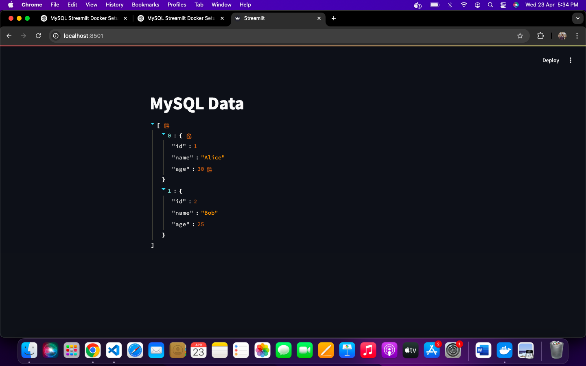

# MySQL and Streamlit Integration with Docker

This project demonstrates how to set up a MySQL container and a Streamlit app container using Docker. The Streamlit app connects to the MySQL container, performs queries, and displays data.

## Prerequisites

- Docker installed on your machine
- Basic knowledge of MySQL and Streamlit
- Access to a terminal (e.g., Terminal on macOS, Command Prompt or PowerShell on Windows)

## Setup Steps

### 1. Create a Custom Bridge Network

First, create a custom Docker network to allow containers to communicate:

```bash
docker network create my-bridge-net

2. Run MySQL Container
Run the MySQL container with the following command, which sets up the necessary environment variables like root password, database name, and user credentials:

bash
Copy
Edit
docker run --name mysql-db \
  --network my-bridge-net \
  -e MYSQL_ROOT_PASSWORD=rootpass \
  -e MYSQL_DATABASE=mydatabase \
  -e MYSQL_USER=myuser \
  -e MYSQL_PASSWORD=mypass \
  -p 3306:3306 \
  -d mysql:latest
3. Create a Table in MySQL
After the MySQL container is running, access the MySQL shell:

bash
Copy
Edit
docker exec -it mysql-db mysql -u root -p
Once inside the MySQL shell, switch to the mydatabase database:

sql
Copy
Edit
USE mydatabase;
Now, create a table and insert some sample data:

sql
Copy
Edit
CREATE TABLE your_table_name (
    id INT AUTO_INCREMENT PRIMARY KEY,
    name VARCHAR(100),
    age INT
);

INSERT INTO your_table_name (name, age) VALUES ('Alice', 30), ('Bob', 25);
4. Run Streamlit Container
Build the Streamlit Docker image using the following command (make sure the Dockerfile is set up correctly):

bash
Copy
Edit
docker build -t streamlit-app .
Run the Streamlit container and connect it to the same custom network:

bash
Copy
Edit
docker run --name streamlit-container \
  --network my-bridge-net \
  -p 8501:8501 \
  -d streamlit-app
5. Update Streamlit App to Query MySQL
In your app.py, ensure that you have the correct MySQL connection settings:

python
Copy
Edit
import mysql.connector

# Connect to the MySQL database
conn = mysql.connector.connect(
    host="mysql-db",  # Container name as host
    user="myuser",
    password="mypass",
    database="mydatabase"
)

cursor = conn.cursor()

# Fetch data from the table
cursor.execute("SELECT * FROM your_table_name")
result = cursor.fetchall()

# Display the results in Streamlit
import streamlit as st
st.write(result)
6. Access the Streamlit App
Once the Streamlit container is up and running, visit http://localhost:8501 in your browser to view the results. The Streamlit app will display data from the MySQL database.

Troubleshooting
If you encounter a permissions error when accessing the MySQL database, ensure that the user has sufficient privileges:

sql
Copy
Edit
GRANT ALL PRIVILEGES ON mydatabase.* TO 'myuser'@'%';
FLUSH PRIVILEGES;
If the table doesn't exist, check that you've created the correct table using the SHOW TABLES; command.

If you face a connection error from Streamlit to MySQL, confirm that both containers are connected to the same Docker network.

## ✅ Final Result

Below is a screenshot of the working Streamlit app successfully fetching data from the MySQL database:


